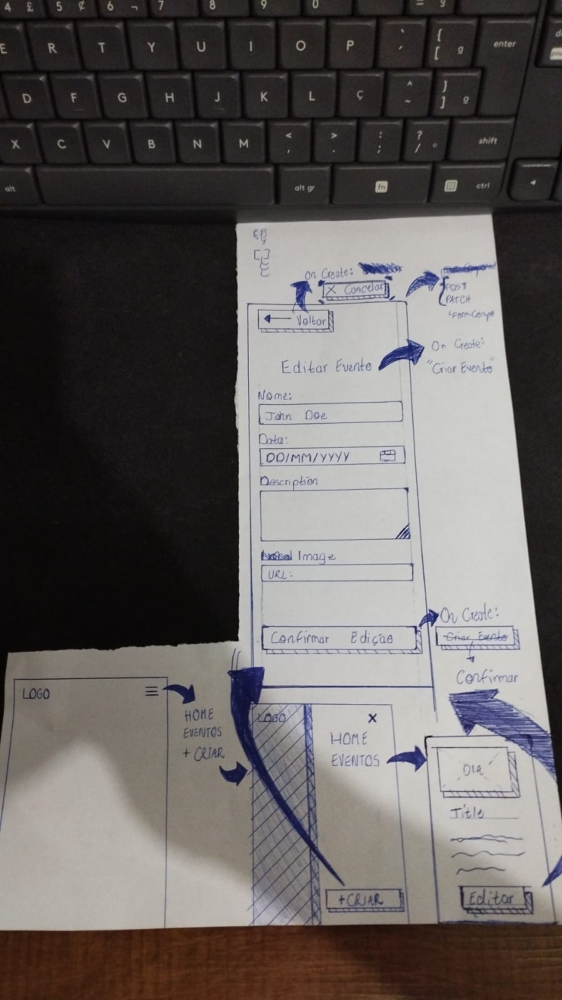
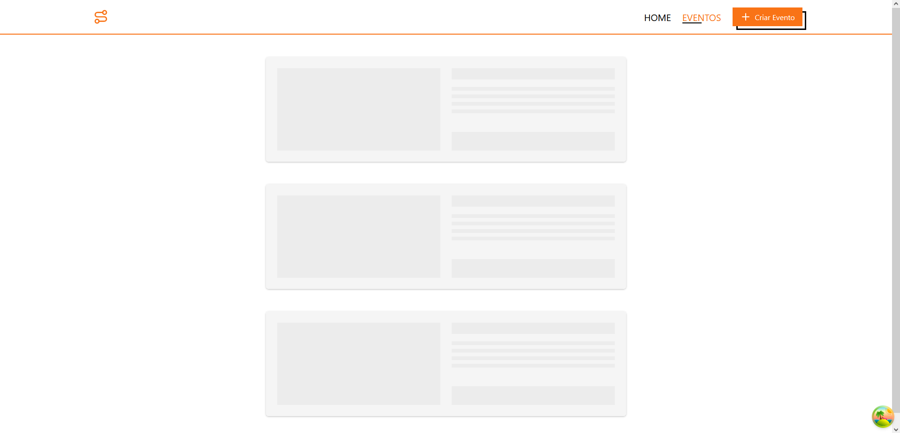

<h1 align="center">
  
</h1>

<h1 align="center">React Router</h1>

<h2> Descrição do Projeto </h2>
<p align="center">
    Explore um projeto fullstack dedicado à criação e gerenciamento de eventos, apresentando uma interface elegante e uma experiência do usuário que supera expectativas! 🤓
</p>

<h3 align="center"> 
	🚀 MVP desenvolvido! 🚀
</h3>

<p align="center">
 <a href="#features">Funcionalidades</a> •
 <a href="#requisitos">Pré-Requisitos</a> • 
 <a href="#run_back">🎲 Rodando o Back End</a> • 
 <a href="#run_front">📟 Rodando o Front End</a> • 
 <a href="#techs">🛠 Tecnologias</a> • 
 <a href="#ui">🎨 UI</a> • 
 <a href="#autor">Autor</a>
</p>

<h2 id='features'>Funcionalidades</h2>

- [x] Visualização de Eventos
- [x] Edição de Eventos
- [x] Criação de Eventos
- [ ] Deletar Eventos

<h2 id='requisitos'>Pré-requisitos</h2>

Antes de começar, você vai precisar ter instalado em sua máquina as seguintes ferramentas:
[Git](https://git-scm.com), [Node.js](https://nodejs.org/en/).
Além disto é bom ter um editor para trabalhar com o código como [VSCode](https://code.visualstudio.com/)

<h2 id='run_back'>🎲 Rodando o Back End (servidor)</h2

```bash
# Clone este repositório
$ git clone <https://github.com/Arthur-Gab/react-router-dom>

# Acesse a pasta do projeto no terminal/cmd
$ cd react-router-dom

# Vá para a pasta server
$ cd backend

# Instale as dependências
$ pnpm install

# Execute a aplicação em modo de desenvolvimento
$ pnpm dev

# O servidor inciará na porta:3000 - acesse <http://localhost:3000>
```

<h2 id='run_front'> 📟 Rodando o Front End </h2>

```bash
# Clone este repositório
$ git clone <https://github.com/Arthur-Gab/react-router-dom>

# Acesse a pasta do projeto no terminal/cmd
$ cd react-router-dom

# Vá para a pasta server
$ cd frontend

# Instale as dependências
$ pnpm install

# Execute a aplicação em modo de desenvolvimento
$ pnpm dev

# O servidor inciará na porta:3838 - acesse <http://localhost:3838>
```

<h2 id='ui'>🎨 UI</h2>

### Low Wireframe



### Monstrando Loading Skeleton Pages



<h2 id='techs'>🛠 Tecnologias</h2>

As seguintes ferramentas foram usadas na construção do projeto:

- [React](https://pt-br.reactjs.org/)
- [React-Router-Dom](https://reactrouter.com/en/main)
- [React-Query](https://tanstack.com/query/v3/)
- [TailwindCSS](https://tailwindcss.com/)
- [Node.js](https://nodejs.org/en/)
- [Express.js](https://expressjs.com/pt-br/)
- [TypeScript](https://www.typescriptlang.org/)
- [Prisma](https://www.prisma.io/)

<h3 id='author'>Autor</h3>

<a href="https://www.linkedin.com/in/art2354">
 
 <br />
 <sub><b>Arthur Gabriel</b></sub></a>

Feito com ❤️ por Arthur Gabriel 👋🏽 Entre em contato!
[](https://www.linkedin.com/in/art2354/)

[](mailto:arthurgabriel933@gmail.com)
